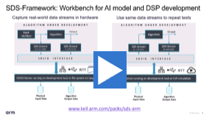
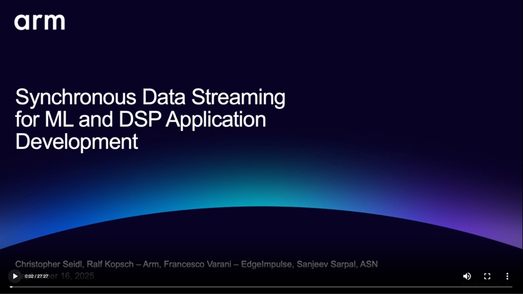

# SDS-Examples

This repository contains examples that show the usage of the [Synchronous Data Streaming (SDS) Framework](https://github.com/ARM-software/SDS-Framework).

**[Watch this video](https://armkeil.blob.core.windows.net/developer/Files/videos/KeilStudio/DevOps_With_Keil_MDK_Webinar.mp4#t=11:27 "SDS-Framework: Workbench for AI model and DSP development")** and explore the projects below.

 

## Quick Start

1. Install [Keil Studio](https://marketplace.visualstudio.com/items?itemName=Arm.keil-studio-pack) and [Arm SDS](https://marketplace.visualstudio.com/items?itemName=Arm.cmsis-sds) from the
   VS Code marketplace.
2. Clone this Git repository into a VS Code workspace.
3. Open the [CMSIS View](https://mdk-packs.github.io/vscode-cmsis-solution-docs/userinterface.html#2-main-area-of-the-cmsis-view)
   in VS Code and use the ... menu to choose an example via *Select Active Solution from workspace*.
4. The related tools and software packs are downloaded and installed. Review progress with *View - Output - CMSIS Solution*.
5. In the CMSIS view, use the
   [Action buttons](https://github.com/ARM-software/vscode-cmsis-csolution?tab=readme-ov-file#action-buttons) to build,
   load and debug the example on target hardware.
6. Follow the instructions in the example README and use the SDS view to show, record, and playback data streams.

## Example Description

The SDS examples are configured for various Evaluation Boards and use the [MDK-Middleware](https://www.keil.arm.com/packs/mdk-middleware-keil/overview/) for the [SDSIO Interface](https://arm-software.github.io/SDS-Framework/main/sdsio.html). New hardware targets can be added using board layers that provide the required API interfaces.
The examples are configured for [Keil Studio for VS Code](https://www.keil.arm.com/).
Run a blinky example for the related board first to verify tool installation.

| Example                                                | Description   |
|---                                                         |---            |
| [Alif/AppKit-E7_USB](./Alif/AppKit-E7_USB/README.md)                   | SDS connecting via USB to [Alif AppKit-E7 board](https://www.keil.arm.com/boards/alif-semiconductor-appkit-e7-aiml-d1-34b5d51/guide/). |
| [Alif/DevKit-E8_ETH](./Alif/DevKit-E8_ETH/README.md)                   | SDS connecting via Ethernet to [Alif DevKit-E8 board](https://www.keil.arm.com/boards/alif-semiconductor-devkit-e8-a1-c8b9599/features/). |
| [ST/B-U585I-IOT02A/MotionRecognition](./ST/B-U585I-IOT02A/MotionRecognition/README.md) | SDS connecting via USB to  [STMicroelectronics B-U585I-IOT02A board](https://www.keil.arm.com/boards/stmicroelectronics-b-u585i-iot02a-revc-c3bc599/features/). Implements motion recognition algorithm with sensor interface.  |
| [ST/B-U585I-IOT02A/KeywordSpotting](./ST/B-U585I-IOT02A/KeywordSpotting/README.md)     | SDS connection via USB to [STMicroelectronics B-U585I-IOT02A board](https://www.keil.arm.com/boards/stmicroelectronics-b-u585i-iot02a-revc-c3bc599/features/). Implements keyword spotting algorithm with audio interface.  |

> [!TIP]
> Each example is self-contained in a directory. The tool configuration and CI workflows are in separate directories listed below.

## Tool and CI Directory Structure

| File/Directory                            | Content |
|---                                        |--- |
| [vcpkg-configuration.json](vcpkg-configuration.json) | Setup for development tools on desktop. |
| [.ci](./.ci)                              | Files that are related to the Continuous Integration (CI) tests. |
| [.github/workflows](./.github/workflows)  | [GitHub Actions](#github-actions) scripts for build and execution tests. |

<!--
## Webinar

The following webinar shows how to use the SDS framework and the examples in this repository:

-->

## Continuous Integration (CI)

The repository uses [GitHub Actions](.github/workflows) to test project build with AC6 and execute algorithm tests.
Refer to [Understanding GitHub Actions](https://docs.github.com/en/actions/get-started/understand-github-actions) and [Arm FVPs](https://arm-software.github.io/AVH/main/infrastructure/html/avh_gh_actions.html) documentation for more information.

| 
 CI Workflow 
                  | Description |
|---                                                            |---  |
| [AC6_test_build](./.github/workflows/AC6_test_build.yaml)     | Use Arm Compiler for Embedded (AC6) to create binaries for different configuration of targets, build types, and boards. After successful generation these are stored as artifacts. |
| [GCC_test_build](./.github/workflows/GCC_test_build.yaml)     | Use GCC build tools to create binaries for different configuration of targets, build types, and boards. After successful generation these are stored as artifacts. |
| [AlgorithmTest_ST_B-U585I-IOT02A_MR](./.github/workflows/AlgorithmTest_ST_B-U585I-IOT02A_MR.yaml)  | Build the binary of a motion recognition algorithm and execute a regression test by using an FVP model and prerecorded SDS files. Regressions are stored as artifacts. |

## Issues or Questions

Raise questions or issues for these examples on the repository [github.com/ARM-software/SDS-Framework](https://github.com/ARM-software/SDS-Framework/tree/main?tab=readme-ov-file#issues-and-labels).
