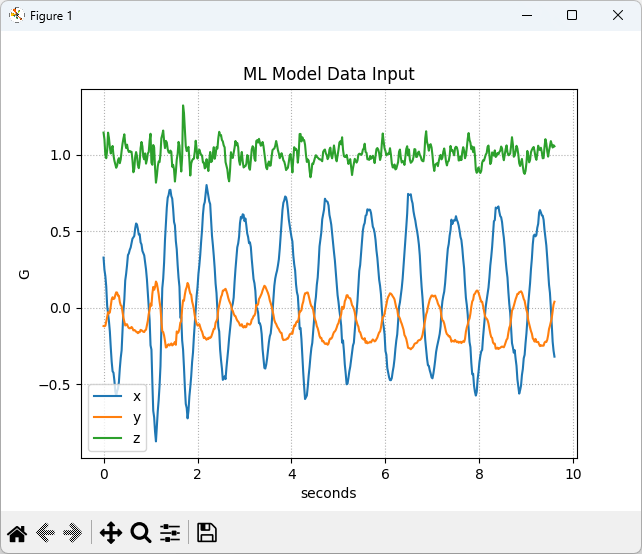
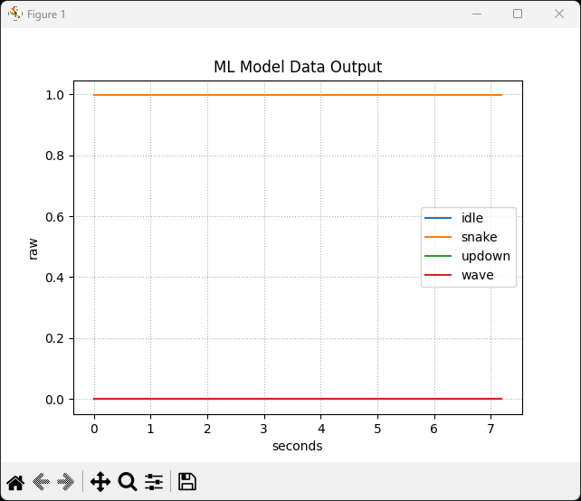

# SDS Recordings with B-U585I-IOT02A Board

## Overview
This folder contains SDS recordings captured with the **B-U585I-IOT02A** board.  
The recordings include accelerometer data as well as machine learning (ML) inference results.
Metadata files describe the format and usage of these recordings.

## File description
- **ML_In.n.sds** – streams of accelerometer data used as input for ML.  
- **ML_Out.n.sds** – streams of ML inference results.  
- **ML_In.sds.yml** – metadata description for all `ML_In.n.sds` files.  
- **ML_Out.sds.yml** – metadata description for all `ML_Out.n.sds` files.  

### Available Recordings
Each file contains **10 seconds** of data:

- **Idle State**  
  - Input:  `ML_In.0.sds`,  `ML_In.1.sds`,  `ML_In.2.sds`  
  - Output: `ML_Out.0.sds`, `ML_Out.1.sds`, `ML_Out.2.sds`  

- **Snake Movement**  
  - Input:  `ML_In.3.sds`,  `ML_In.4.sds`,  `ML_In.5.sds`  
  - Output: `ML_Out.3.sds`, `ML_Out.4.sds`, `ML_Out.5.sds`  

- **Up/Down Movement**  
  - Input:  `ML_In.6.sds`,  `ML_In.7.sds`,  `ML_In.8.sds`  
  - Output: `ML_Out.6.sds`, `ML_Out.7.sds`, `ML_Out.8.sds`  

- **Wave Movement**  
  - Input:  `ML_In.9.sds`,  `ML_In.10.sds`,  `ML_In.11.sds`  
  - Output: `ML_Out.9.sds`, `ML_Out.10.sds`, `ML_Out.11.sds`  

## Visualization
You can graphically represent SDS files using the **SDS-View** utility.

1. Copy the `sds-view.py` file from the SDS installation (`/utilities` sub-folder) into this folder.  
2. Run the following command to visualize an input recording:

   ```bash
   python sds-view.py -i ML_In.3.sds -y ML_In.sds.yml
   ```
   Example visualization:

   

3. To visualize an output recording:

   ```bash
   python sds-view.py -i ML_Out.3.sds -y ML_Out.sds.yml
   ```
   Example visualization:

   
